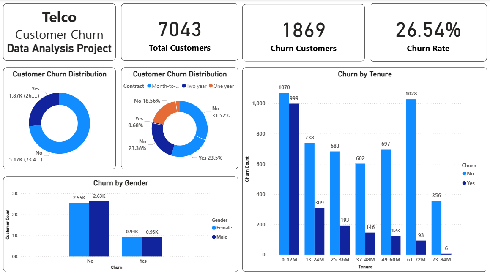
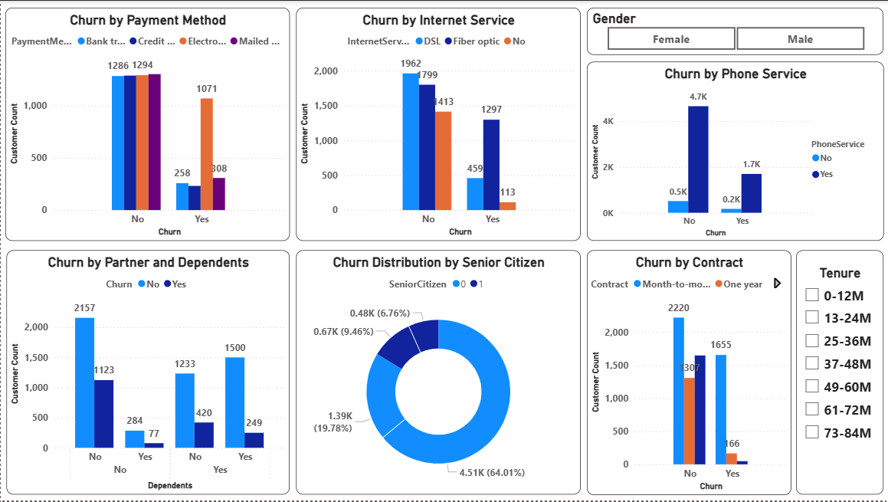
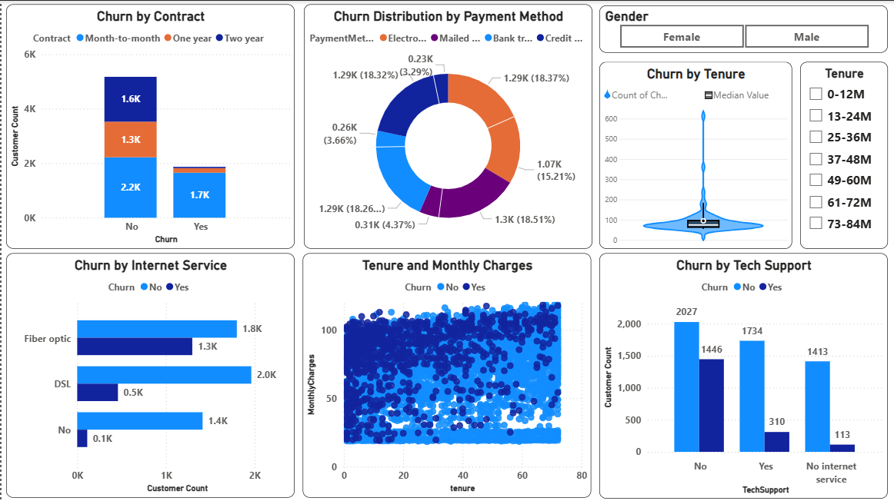

# Telco_Customer_Churn_Analysis-End-to-End-Project

## 1. Project Overview
In the highly competitive telecommunications industry, customer churn (the rate at which customers discontinue their service) is a critical challenge. Acquiring new customers is significantly more expensive than retaining existing ones. This project aims to analyze customer data from a fictional telecom company to identify the key drivers of churn and provide actionable recommendations to improve customer retention.

## Business Problem: 
The telecom company is experiencing customer attrition, leading to lost revenue and market share. There is a lack of clear understanding regarding why customers are leaving and who is most likely to churn.

## Project Objectives:

  - **Descriptive Analysis:** Understand the current churn rate and profile of churned customers based on demographics, service usage, and billing information.

  - **Diagnostic Analysis:** Identify the underlying factors and relationships that contribute to customer churn.

  - **Prescriptive Analysis:** Develop data-backed, actionable recommendations to mitigate churn and enhance customer retention strategies.

## 2. Data Source & Acquisition
The dataset used for this analysis is the Telco Customer Churn dataset, publicly available on Kaggle. It contains information about 7,043 customers, including:

- **Demographic Information:** `Gender`, `SeniorCitizen`, `Partner`, `Dependents`.

- **Customer Account Information:** `Tenure (months)`, `Contract type`, `PaperlessBilling`, `PaymentMethod`, `MonthlyCharges`, `TotalCharges`.

- **Services Subscribed:** `PhoneService`, `MultipleLines`, `InternetService` (DSL, Fiber optic, No), `OnlineSecurity`, `OnlineBackup`, `DeviceProtection`, `TechSupport`, `StreamingTV`, `StreamingMovies`.

- **Target Variable:** `Churn` (Yes/No), indicating if the customer left the company within the last month.

The dataset was initially downloaded as a CSV file.

## 3. Methodology
This project followed a structured data analysis workflow, leveraging a combination of Python, SQL, and Power BI.

- **Python (Pandas, SQLAlchemy):** Used for data loading, initial data cleaning, feature engineering, and connecting to the database.

- **SQL (MySQL):** Employed for efficient data storage, management, and performing quick aggregations and statistical summaries.

- **Power BI:** Utilized for creating an interactive and visually compelling dashboard to present key findings, diagnostic insights, and actionable recommendations to stakeholders.

## 4. Data Preparation & Cleaning
The initial dataset required several preparation and cleaning steps to ensure data quality and suitability for analysis:

- **Data Loading:** The Telco-Customer-Churn.csv file was loaded into a Pandas DataFrame.

- **Initial Inspection:** df.info() and df.describe() were used to understand data types, identify missing values, and get summary statistics for numerical columns. df.describe(exclude=['number']) was used for categorical columns.

- **Handling Missing Values:** The TotalCharges column was identified as an object type with some missing values (represented as empty strings). These were converted to numerical type, and missing values (which typically occur for customers with 0 tenure) were imputed with 0.

- **Feature Engineering (tenure_bins):** A new categorical feature, tenure_bins, was created from the tenure column. This groups customers into meaningful tenure ranges (e.g., '0-12M', '13-24M', '25-36M', etc.) to better analyze churn patterns across customer lifecycle stages.

- **Data Storage (MySQL):** The cleaned and prepared DataFrame was then loaded into a MySQL database named telco_churn into a table called churn_data for persistent storage and efficient querying.

## 5. Exploratory Data Analysis (EDA) & Key Findings
The EDA phase combined SQL queries for initial insights and Python for detailed visualizations, with the final results presented in Power BI.

## SQL-Driven Quick Statistics & Summaries:
SQL queries were executed to derive foundational metrics:

- **Overall Churn Rate:** Calculated the total number of customers and the overall churn rate.

- **Demographic Churn:** Analyzed churn rates across gender, senior citizen status, and partner status.

  ```sql
  
  -- 1. Overall Churn & Demographic Profile

-- What is the total number of customers and the overall churn rate?
SELECT 
    COUNT(*) AS Total_Customers,
    SUM(CASE
        WHEN Churn = 'Yes' THEN 1
        ELSE 0
    END) AS churned_customers,
    (SUM(CASE
        WHEN Churn = 'Yes' THEN 1
        ELSE 0
    END) * 1.0 / COUNT(*)) * 100 AS churn_rate
FROM
    churn_data;
    

-- How does the churn rate differ between male and female customers?
SELECT 
    gender,
    COUNT(*) AS Total_Gender_Count,
    SUM(CASE
        WHEN Churn = 'Yes' THEN 1
        ELSE 0
    END) * 1 AS Gender,
    (SUM(CASE
        WHEN Churn = 'Yes' THEN 1
        ELSE 0
    END) * 1 / COUNT(*) * 100) AS GenderChurnRate
FROM
    churn_data
GROUP BY gender;


-- What is the churn rate for senior citizens compared to non-senior citizens?
SELECT 
    COUNT(*) AS Total_Customers,
    SUM(CASE
        WHEN SeniorCitizen = 1 THEN 1
        ELSE 0
    END) AS SenoirCitizenCount,
    (SUM(CASE
        WHEN SeniorCitizen = 1 THEN 1
        ELSE 0
    END) / COUNT(*)) * 100 AS SenoirCitizenChurnRate
FROM
    churn_data;


-- What is the churn rate for customers who are married versus those who are not?
SELECT 
    COUNT(*) AS Total_Customers,
    SUM(CASE
        WHEN Partner = 'Yes' THEN 1
        ELSE 0
    END) AS Married,
    (SUM(CASE
        WHEN Partner = 'Yes' THEN 1
        ELSE 0
    END) * 1 / COUNT(*)) * 100 AS Married_Rate,
    (SUM(CASE
        WHEN (Partner = 'Yes' AND Churn = 'Yes') THEN 1
        ELSE 0
    END) / COUNT(*)) * 100 AS Partner_Churn
FROM
    churn_data;


- **Tenure-Based Churn:** Determined average tenure for churned vs. non-churned customers and churn rates across different tenure_bins.
```sql
-- 2. Customer Tenure & Churn

-- What is the average tenure for customers who have churned? What about for those who have not?
SELECT 
    Churn, COUNT(*) AS Churn_Count, AVG(tenure) AS AvgTenure
FROM
    churn_data
GROUP BY Churn;


-- How many customers are there in each of the tenure groups you created (e.g., 0-12 months, 13-24 months, etc.)?
SELECT 
    tenure_bins, COUNT(*) AS Customers_Count
FROM
    churn_data
GROUP BY tenure_bins;


-- What is the churn rate for each of these tenure groups?
SELECT 
    tenure_bins,
    COUNT(*) AS Customers_Count,
    SUM(CASE
        WHEN Churn = 'Yes' THEN 1
        ELSE 0
    END) AS Churn_Count,
    (SUM(CASE
        WHEN Churn = 'Yes' THEN 1
        ELSE 0
    END) / COUNT(*)) * 100 AS ChurnRate
FROM
    churn_data
GROUP BY tenure_bins
ORDER BY ChurnRate DESC;
```

- **Service Usage Churn:** Explored churn rates based on phone service, internet service type (DSL, Fiber Optic), and tech support.

```sql
-- 3. Service Usage & Dependencies

-- What is the churn rate for customers who have phone service versus those who do not?
SELECT 
    PhoneService,
    COUNT(*) AS CustomerCount,
    SUM(CASE
        WHEN Churn = 'Yes' THEN 1
        ELSE 0
    END) AS ChurnCount,
    (SUM(CASE
        WHEN Churn = 'Yes' THEN 1
        ELSE 0
    END) / COUNT(*)) * 100 AS ChurnRate
FROM
    churn_data
GROUP BY PhoneService;


-- For customers with internet service, how does the churn rate vary by InternetService type (DSL, Fiber Optic, No Internet)?
SELECT 
    TechSupport,
    COUNT(*) AS customerCount,
    SUM(CASE
        WHEN churn = 'Yes' THEN 1
        ELSE 0
    END) AS ChurnCount,
    (SUM(CASE
        WHEN churn = 'Yes' THEN 1
        ELSE 0
    END) / COUNT(*)) * 100 AS ChurnRate
FROM
    churn_data
GROUP BY TechSupport;


-- Among customers with multiple lines, is the churn rate higher or lower compared to customers with a single line?
SELECT 
    MultipleLines,
    COUNT(*) AS customerCount,
    SUM(CASE
        WHEN churn = 'Yes' THEN 1
        ELSE 0
    END) AS ChurnCount,
    (SUM(CASE
        WHEN churn = 'Yes' THEN 1
        ELSE 0
    END) / COUNT(*)) * 100 AS ChurnRate
FROM
    churn_data
GROUP BY MultipleLines;


-- What is the churn rate for customers who have tech support versus those who do not?
SELECT 
    MultipleLines,
    COUNT(*) AS customerCount,
    SUM(CASE
        WHEN churn = 'Yes' THEN 1
        ELSE 0
    END) AS ChurnCount,
    (SUM(CASE
        WHEN churn = 'Yes' THEN 1
        ELSE 0
    END) / COUNT(*)) * 100 AS ChurnRate
FROM
    churn_data
GROUP BY MultipleLines;


-- How many customers have a Partner and what is their churn rate? How does this compare to customers who do not have a partner?
SELECT 
    Partner,
    COUNT(*) AS customerCount,
    SUM(CASE
        WHEN churn = 'Yes' THEN 1
        ELSE 0
    END) AS ChurnCount,
    (SUM(CASE
        WHEN churn = 'Yes' THEN 1
        ELSE 0
    END) / COUNT(*)) * 100 AS ChurnRate
FROM
    churn_data
GROUP BY Partner;
```
- **Billing & Contract Churn:** Investigated churn rates by contract type, payment method, and average monthly charges for churned vs. non-churned groups.

  ```sql
  -- 4. Billing & Contract Information

-- What is the churn rate for each Contract type (Month-to-month, One year, Two year)?
SELECT 
    Contract,
    COUNT(*) AS CustomerCount,
    SUM(CASE
        WHEN Churn = 'Yes' THEN 1
        ELSE 0
    END) AS ChurnCount,
    (SUM(CASE
        WHEN Churn = 'Yes' THEN 1
        ELSE 0
    END) / COUNT(*)) * 100 AS ChurnRate
FROM
    churn_data
GROUP BY Contract;

-- How does the churn rate vary by PaymentMethod (e.g., Electronic Check, Mailed Check, etc.)?
SELECT 
    PaymentMethod,
    COUNT(*) AS CustomerCount,
    SUM(CASE
        WHEN Churn = 'Yes' THEN 1
        ELSE 0
    END) AS ChurnCount,
    (SUM(CASE
        WHEN Churn = 'Yes' THEN 1
        ELSE 0
    END) / COUNT(*)) * 100 AS ChurnRate
FROM
    churn_data
GROUP BY PaymentMethod;

-- What are the average MonthlyCharges for customers who have churned versus those who have not?
SELECT 
    Churn, AVG(MonthlyCharges) AS AvgMonthlyCharges
FROM
    churn_data
GROUP BY Churn;

-- What are the average TotalCharges for customers in each Contract type?
SELECT 
    Churn, AVG(TotalCharges) AS AvgTotalCharges
FROM
    churn_data
GROUP BY Churn;

-- How many customers use paperless billing, and what is their churn rate compared to those who don't?
SELECT 
    PaperlessBilling,
    COUNT(*) AS CustomerCount,
    SUM(CASE
        WHEN Churn = 'Yes' THEN 1
        ELSE 0
    END) AS ChurnCount,
    (SUM(CASE
        WHEN Churn = 'Yes' THEN 1
        ELSE 0
    END) / COUNT(*)) * 100 AS ChurnRate
FROM
    churn_data
GROUP BY PaperlessBilling;


## Power BI Visualizations & Insights:
The Power BI report effectively visualizes these insights across multiple pages:

## Page 1: Overview
This page provides an executive summary of the churn landscape.

**Total Customers: 7043**

**Churn Customers: 1869**

**Churn Rate: 26.54%** (indicating a significant portion of customers are leaving).

**Customer Churn Distribution (Overall):** A donut chart clearly shows that approximately `26.5%` of customers have churned.

**Customer Churn Distribution (by Contract):** This donut chart highlights a critical insight: Month-to-month contracts account for a disproportionately high percentage of churned customers (`23.5%` of total customers churned are month-to-month, while only `0.68%` are two-year contract churners).

**Churn by Tenure:** A bar chart shows that churn is highest in the `0-12 months tenure group`, with 1070 non-churned and 999 churned customers. Churn generally decreases as tenure increases, indicating that newer customers are at higher risk.

**Churn by Gender:** A bar chart indicates that churn rates are relatively similar between male and female customers (around 0.94K vs 0.93K churned respectively), suggesting gender is not a primary differentiator for churn.



## Page 2: Churn Drivers
This page delves deeper into specific drivers, confirming insights from SQL and Python.

**Churn by Payment Method:** Bar charts show that Electronic Check has the highest number of churned customers (`1071`), significantly more than other payment methods.

**Churn by Internet Service:** Bar charts reveal that Fiber Optic internet service has a much higher churn count (`1297`) compared to DSL (`459`) or no internet service (`113`). This is a critical insight.

**Churn by Phone Service:** A bar chart indicates that customers with phone service have a higher number of churned customers than those without, but the churn rate might be similar given the larger base.

**Churn by Partner and Dependents:** Bar charts suggest that customers without partners and without dependents have higher churn counts compared to those with partners/dependents, implying these factors contribute to customer stickiness.

**Churn Distribution by Senior Citizen:** A donut chart shows that while senior citizens make up a smaller portion of the total customer base (`19.78%`), their churn rate (`6.76%` of total churn) is notable and higher than their representation in the customer base.

**Churn by Contract:** A stacked bar chart visually reinforces that Month-to-month contracts have the highest churn volume, both in absolute numbers and proportionally.



## Page 3: Key Insights & Deep Dive
This page provides more granular diagnostic insights into the most impactful churn drivers.

**Churn by Contract:** A stacked bar chart prominently displays the churn counts by contract type, clearly showing that the majority of churn occurs within Month-to-month contracts.

**Churn Distribution by Payment Method:** A donut chart reiterates that Electronic Check is the most common payment method among churned customers (`15.21%` of total customers churned use Electronic Check).

**Churn by Tenure (Violin Plot):** A violin plot of Churn by Tenure shows the distribution of tenure for churned vs. non-churned customers. It visually confirms that churned customers tend to have shorter tenures, with a denser distribution towards the lower end of the tenure spectrum.

**Churn by Internet Service:** A bar chart again highlights Fiber Optic as the internet service with the highest churn count.

**Tenure and Monthly Charges (Scatter Plot):** This scatter plot shows MonthlyCharges vs. tenure, with points colored by Churn status. It visually suggests that customers with high monthly charges and low tenure are a significant segment of churned customers. This is a powerful diagnostic insight.

**Churn by Tech Support:** A bar chart indicates that customers without Tech Support have a significantly higher churn count (`1413` churned customers) compared to those with Tech Support (`113` churned customers), suggesting a strong link between lack of support and churn.



## 6. Actionable Recommendations
Based on the comprehensive descriptive and diagnostic analysis, the following actionable recommendations are proposed to Telco to reduce customer churn:

## 1. Prioritize Month-to-Month Contract Customers:

**Problem:** Customers on month-to-month contracts have the highest churn rate and represent the largest volume of churned customers.

**Recommendation:** Implement targeted campaigns offering incentives (e.g., discounts, free upgrades, loyalty bonuses) for month-to-month customers to switch to longer-term (one-year or two-year) contracts. Focus these efforts on newer customers within the 0-12 month tenure range.

## 2. Optimize Electronic Check Payment Experience:

**Problem:** Electronic Check is the payment method with the highest churn rate.

**Recommendation:** Investigate the underlying reasons for dissatisfaction among Electronic Check users. This could involve improving the online payment portal, offering incentives for switching to automated bank transfers or credit card payments, or enhancing communication regarding billing.

## 3. Address Fiber Optic Service Quality & Support:

**Problem:** Fiber Optic internet service users and customers without Tech Support show significantly higher churn. The scatter plot also suggests high monthly charges for short-tenure Fiber Optic customers are problematic.

**Recommendation:**

- Conduct a deeper analysis into common issues faced by Fiber Optic customers (e.g., network reliability, speed consistency).

- Proactively offer free or discounted Tech Support to Fiber Optic customers, especially new ones or those with high monthly charges.

- Improve the responsiveness and effectiveness of general Tech Support services.

## 4. Implement Early Life Cycle Engagement for New Customers:

**Problem:** The 0-12 month tenure group exhibits the highest churn.

**Recommendation:** Develop a structured onboarding and early engagement program for new customers. This could include welcome calls, proactive check-ins, educational resources for services, and early identification of potential issues to address them before churn occurs.

## 5. Leverage Partner & Dependent Status for Retention:

**Problem:** Customers without partners or dependents show higher churn.

**Recommendation:** Explore family-oriented plans or loyalty programs for customers with partners and dependents, reinforcing their existing stickiness. For single customers or those without dependents, offer personalized bundles or community engagement opportunities to build a stronger connection.

## 7. Tools Used
**Data Acquisition & Preparation:** Python (Pandas, SQLAlchemy)

**Data Storage & Management:** MySQL

**Data Analysis & Visualization:** Python (Matplotlib, Seaborn), Power BI

**Reporting & Presentation:** Power BI

## 8. Conclusion & Future Work
This project successfully identified key drivers of customer churn within the telecom dataset, providing a clear understanding of who is churning and why. The analysis highlighted critical areas such as month-to-month contracts, electronic payment methods, fiber optic service, and early customer tenure as significant contributors to churn. The proposed recommendations offer actionable strategies for Telco to improve customer retention and ultimately enhance profitability.

**Future Work:**

**Predictive Modeling:** Build a machine learning model to predict individual customer churn probability, enabling proactive, personalized interventions.


### Author - BB Siva Venkatesh

This project is part of my portfolio, showcasing the End-to-End Data Analysis skills essential for data analyst roles. If you have any questions, feedback, or would like to collaborate, feel free to get in touch!

- **LinkedIn**: [Connect with me professionally](https://www.linkedin.com/in/siva-venkatesh/)


Thank you for your support, and I look forward to connecting with you!
